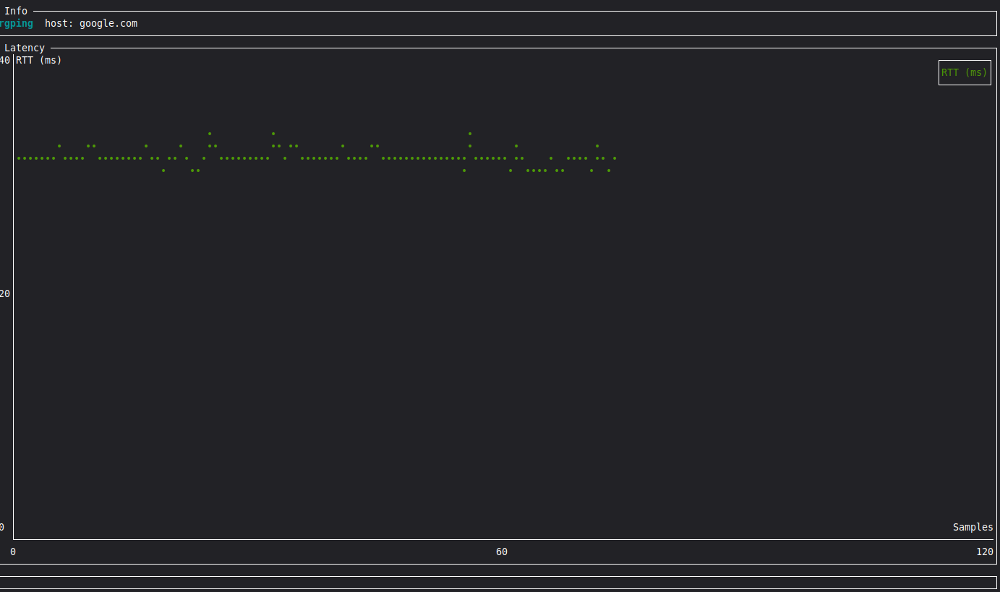

# rgping

Rust gping implementation ;)



## Features

- Fast and efficient network ping implementation
- Cross-platform support
- Simple and intuitive command-line interface

## Installation

```bash
cargo install rgping

```

## Building deb


```bash
cargo install cargo-deb
cargo deb
```

## Usage

```bash
rgping [target]


```

Example:
```bash
rgping google.com
```

## License

MIT License

## Contributing

Pull requests are welcome. For major changes, please open an issue first to discuss what you would like to change.